<h1 align="center">1. PREPARAÇÃO DO AMBIENTE</h1>
<details><summary><b>ℹ️ Clique para ver os detalhes</b></summary>

### `requirements.txt`

São as bibliotecas Python que o projeto vai usar.

```py
db-dtypes               # Tipos de dados extras usados pelo BigQuery no pandas (DATE, TIME, STRUCT etc.)
google-auth             # Autenticação e credenciais para acessar APIs e serviços Google
google-cloud-bigquery   # Cliente oficial Python para consultar e manipular dados no BigQuery
igmapper                # Biblioteca para mapeamento/geolocalização e visualização de dados geográficos
ipykernel               # Kernel do Python para execução em notebooks Jupyter
pandas-gbq              # Integração entre pandas e BigQuery para ler/escrever tabelas facilmente
pandas                  # Manipulação e análise de dados em DataFrames
selenium                # Automação de navegador para scraping e testes web
tmdbsimple              # Cliente Python simples para consumir a API do The Movie Database (TMDB)
```

### Ativar ambiente virtual (`venv`)

**O que é?** É um ambiente virtual do Python que cria um espaço isolado para instalar bibliotecas de um projeto sem afetar os outros projetos ou o Python do sistema.

**Linux/macOS**

1. Cria um ambiente virtual Python na pasta `.venv`
    ```sh
    python3.14 -m venv .venv
    ```
2. Ativa o ambiente virtual
    ```sh
    source .venv/bin/activate
    ```
3. Atualiza o pip para a versão mais recente
    ```sh
    pip install --upgrade pip
    ```
4. Instala todas as dependências do projeto
    ```sh
    pip install -r requirements.txt
    ```

**Windows (PowerShell)**

1. Cria um ambiente virtual Python na pasta `.venv`
    ```ps
    python -m venv .venv
    ```
2. Permite executar scripts locais no PowerShell
    ```ps
    Set-ExecutionPolicy RemoteSigned -Scope CurrentUser
    ```
3. Ativa o ambiente virtual no PowerShell
    ```ps
    .venv\Scripts\Activate.ps1
    ```
4. Instala todas as dependências do projeto
    ```ps
    python -m pip install -r requirements.txt
    ```

> [!NOTE]
> Instalação separada (sem usar `requirements.txt`)
> ```py
> pip install db-dtypes google-auth google-cloud-bigquery igmapper ipykernel pandas-gbq pandas selenium tmdbsimple
> ```

> [!WARNING]
> Erro `ModuleNotFoundError` → Dependência não instalada no ambiente virtual.
> ```py
> ------------------------------------------------------------
> ModuleNotFoundError        Traceback (most recent call last)
> Cell In[1], line 1
> ----> 1 import BIBLIOTECA_X
>
> ModuleNotFoundError: No module named 'BIBLIOTECA_X'
> ```
>
> Resolva:
> ```py
> pip install BIBLIOTECA_X
> ```

> [!TIP]
> Limpar tudo do Ambiente Virtual
> 
> Limpar Cache do PIP
> ```py
> pip cache purge
> ```
> Desinstalar tudo que já foi instalado no VENV
> ```py
> # Linux
> pip freeze > req_installed.txt && pip uninstall -r req_installed.txt -y && pip cache purge
> 
> # Windows (PowerShell)
> pip freeze > req_installed.txt; pip uninstall -r req_installed.txt -y; pip cache purge
> ```


### VSCode Extensions
- Black Formatter (Microsoft)
- Jupyter (Microsoft)
- Python (Microsoft)
- Pylance (Microsoft)
- Pylint (Microsoft)
</details>

<h1 align="center">2. CONFIGURAÇÃO DO BIGQUERY</h1>
<details><summary><b>ℹ️ Clique para ver os detalhes</b></summary>

### 1. Criar Projeto no GCP

- ### https://console.cloud.google.com

> <div align="center">
>     
>     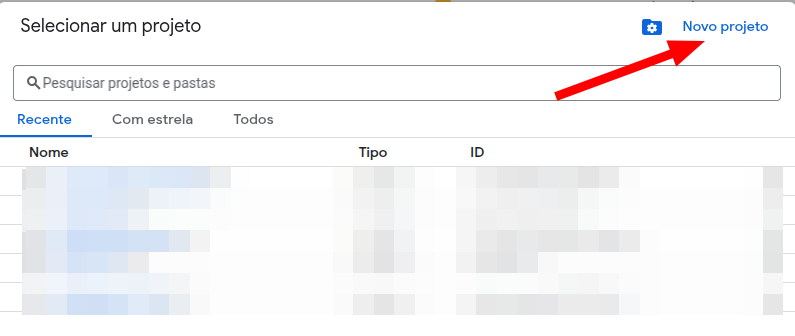
>     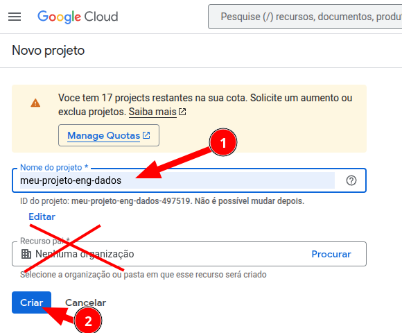
>     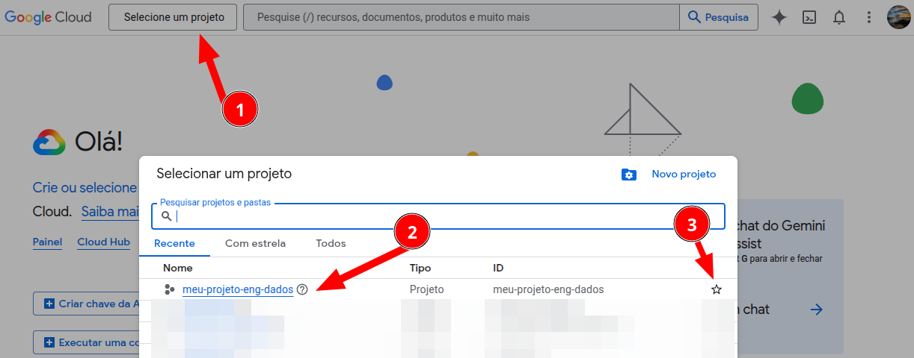
>     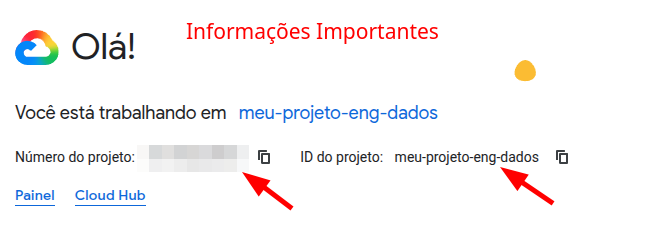
> </div>

### Criar a Service Account

Cria uma conta de serviço para autenticar o acesso ao BigQuery.

#### Adicionar os papéis:

- **BigQuery Data Editor** → Acesso para editar todos os tipos de conteúdo de conjuntos de dados
- **BigQuery Job User** → Acesso para executar jobs

> <div align="center">
>     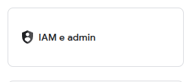 <br>
>     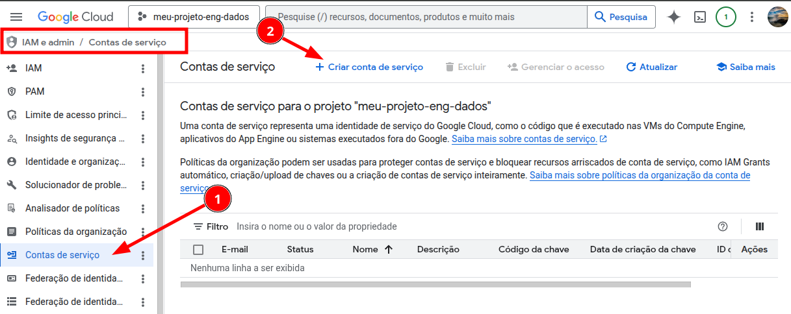
>     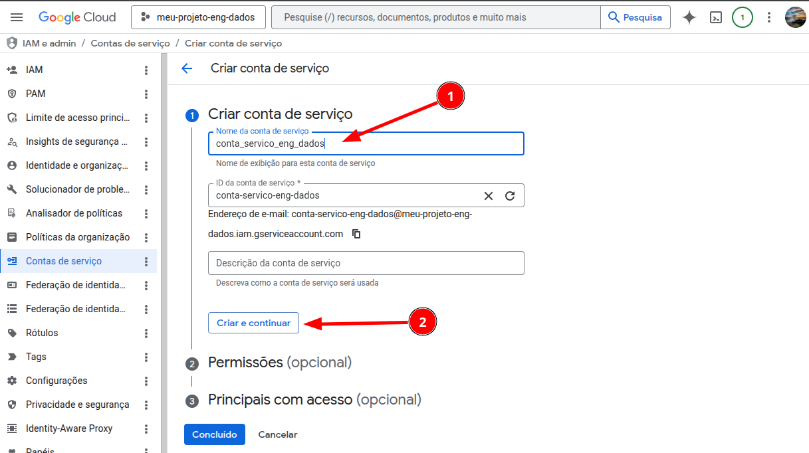
>     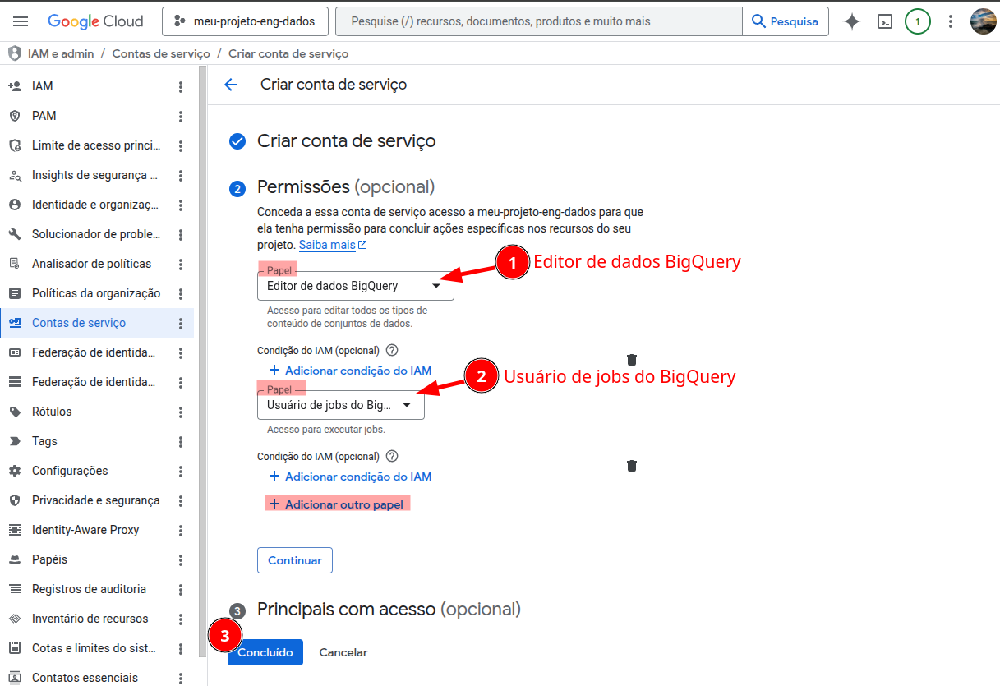
> </div>

#### Baixar chave:
> <div align="center">
>     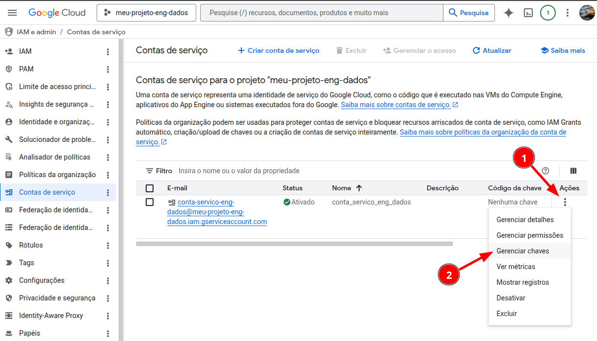
>     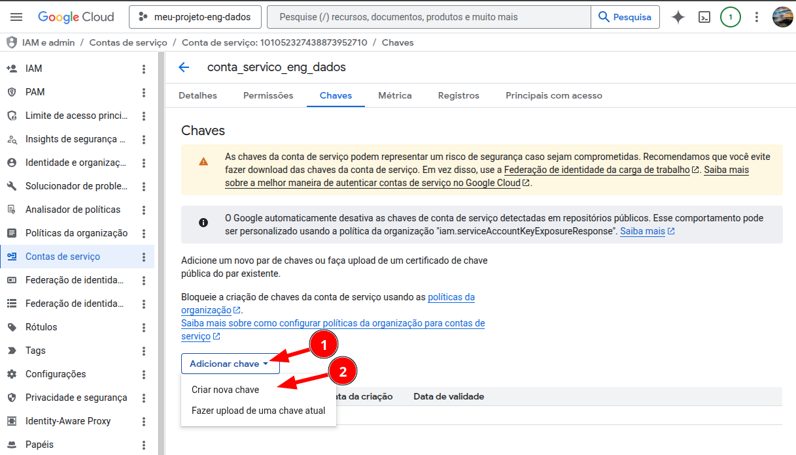
>     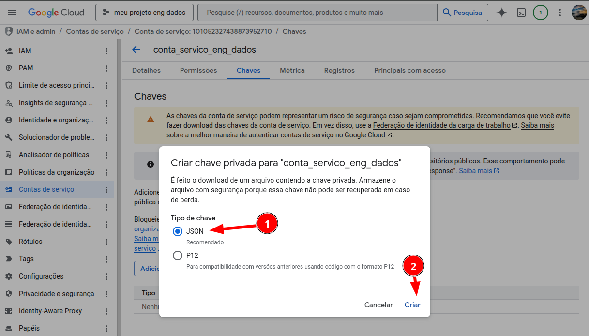 <br>
>     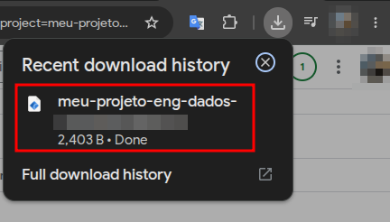
> </div>

</details>

<h1 align="center">3. CÓDIGO · Ingestão</h1>
<details><summary><b>ℹ️ Clique para ver os detalhes</b></summary>

### Imports

1. Importa as bibliotecas usadas no projeto para BigQuery, Selenium, Pandas, TMDB e manipulação do sistema operacional.
    ```py
    from google.cloud import bigquery
    from google.oauth2 import service_account

    from selenium import webdriver
    from selenium.webdriver.common.by import By

    import pandas as pd
    import tmdbsimple as tmdb
    import os
    ```

### Configuração do Pandas

2. Define como os DataFrames serão exibidos no notebook.
    ```py
    pd.set_option("display.max_columns", None)
    pd.set_option("display.max_rows", 20)
    ```

### Definição das Fontes de Dados

#### GitHub

3. URL base dos arquivos CSV armazenados no GitHub.
    ```py
    dataset_movies_url = "https://media.githubusercontent.com/media/lucas-aulas/dataset-movies/refs/heads/main"
    ```

#### GCP

4. Define o ID do projeto no Google Cloud Platform.
    ```py
    gcp_project_id = "project202605-496913"
    ```


### Definir as Credenciais

5. Carrega o arquivo JSON da Service Account para autenticação no GCP.
    - Salve na pasta `/secrets/` o seu arquivo JSON baixado.
    ```py
    my_gcp_sa_file = "../secrets/___SEU_ARQUIVO_JSON___.json"
    ```
    ```py
    my_gcp_cred = service_account.Credentials.from_service_account_file(my_gcp_sa_file)
    ```

### Criar Cliente do BigQuery

6. Cria a conexão informando explicitamente o projeto do GCP.
    ```py
    my_gcp_client = bigquery.Client(credentials=my_gcp_cred, project=gcp_project_id)
    ```

<h1 align="center">Ingestão de Dados (EXTRACT)</h1>

### GitHub

Lê um arquivo CSV hospedado no GitHub e carrega em um DataFrame.

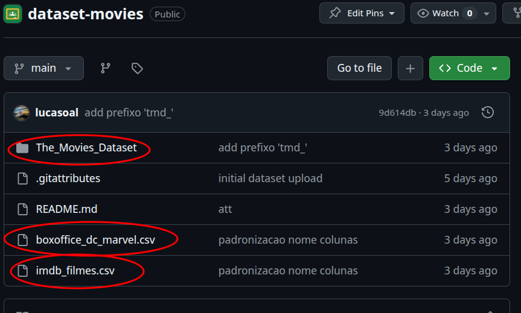

```py
df = pd.read_csv(f"{dataset_movies_url}/___NOME_DO_ARQUIVO___.csv")
```

```py
# Ex:
df_imdb_filmes = pd.read_csv(f"{dataset_movies_url}/imdb_filmes.csv")

df_tmd_ratings_small = pd.read_csv(f"{dataset_movies_url}/The_Movies_Dataset/tmd_ratings_small.csv")
```


### BigQuery

Executa uma consulta SQL no BigQuery e retorna os dados em DataFrame.

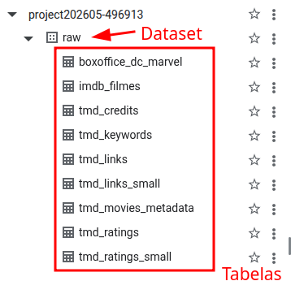

```py
df = my_gcp_client.query(
    f"""
    SELECT *
    FROM {gcp_project_id}.___DATASET___.___TABELA___
    """
).to_dataframe(create_bqstorage_client=False)
```

```py
# Ex:
df_boxoffice_dc_marvel = my_gcp_client.query(
    f"""
    SELECT *
    FROM {gcp_project_id}.raw.imdb_filmes
    """
).to_dataframe(create_bqstorage_client=False)
```

<h1 align="center">Envio de Dados para o BigQuery (LOAD)</h1>

### Opção 1: `to_gbq` *recomendada

Envia um DataFrame para o BigQuery usando pandas-gbq.

```py
df.to_gbq(
    project_id="_____",
    destination_table="dataset.table_name",
    if_exists="replace",
    credentials=my_gcp_cred,
)
```

```py
# Ex:
df_boxoffice_dc_marvel.to_gbq(
    project_id="___ID_DO_SEU_PROJETO___",
    destination_table="bronze.boxoffice_dc_marvel",
    if_exists="replace",
    credentials=my_gcp_cred,
)
```

### Opção 2: `load_table_from_dataframe`

Envia um DataFrame do Pandas para uma tabela no BigQuery.

```py
my_gcp_client.load_table_from_dataframe(df, "dataset.table_name")
```

```py
# Ex:
my_gcp_client.load_table_from_dataframe(df_boxoffice_dc_marvel, "bronze.boxoffice_dc_marvel")
```
</details>

<h1 align="center">4. CÓDIGO · Tratamento</h1>
<details><summary><b>ℹ️ Clique para ver os detalhes</b></summary>

1. Bibliotecas que vão ser utilizadas
    ```py
    from google.cloud import bigquery
    from google.oauth2 import service_account
    import pandas as pd

    # CONFIGS PARA VIEW
    pd.set_option("display.max_columns", None)
    pd.set_option("display.max_rows", 10)
    ```
2. Variáveis e informações para a ingestão
    ```py
    # +++++++++++++++++++++
    # + INGESTAO DE DADOS +

    # MEU BANCO
    gcp_service_acc_file_aluno = "../secrets/__________.json"
    gcp_id_do_projeto = "__________"

    my_gcp_cred = service_account.Credentials.from_service_account_file(
        gcp_service_acc_file_aluno
    )

    my_gcp_client = bigquery.Client(
        credentials=my_gcp_cred
    )
    ```
3. Leitura da tabela `boxoffice_dc_marvel` no BigQuery
    ```py
    df_boxoffice_dc_marvel = my_gcp_client.query(
        f"""
        SELECT *
        FROM {gcp_id_do_projeto}.bronze.boxoffice_dc_marvel
        """
    ).to_dataframe(create_bqstorage_client=False)
    ```
4. Leitura da tabela `imdb_filmes` no BigQuery
    ```py
    df_imdb_filmes = my_gcp_client.query(
        f"""
        SELECT *
        FROM {gcp_id_do_projeto}.bronze.imdb_filmes
        """
    ).to_dataframe(create_bqstorage_client=False)
    ```
5. Merge dos DataFrames
    ```py
    df_complete_movie_info = (
        pd.merge(
            df_boxoffice_dc_marvel,
            df_imdb_filmes,
            left_on=["FILM", "YEAR"],
            right_on=["TITLE", "YEAR"],
            how="outer"
        )
        .sort_values(by="YEAR", ascending=False)
        .drop_duplicates(keep="last")
    )
    ```
6. Filtrando apenas filmes da Marvel e DC
    ```py
    df_complete_dc_marvel = df_complete_movie_info[
        (df_complete_movie_info["FRANCHISE"] == "Marvel") |
        (df_complete_movie_info["FRANCHISE"] == "DC")
    ]
    ```
7. Removendo colunas desnecessárias
    ```py
    df_complete_dc_marvel = df_complete_dc_marvel.drop(
        columns=[
            "25X_PROD",
            "BOX_OFFICE_GROSS_DOMESTIC_US_AND_CANADA",
            "BOX_OFFICE_GROSS_WORLDWIDE",
            "BUDGET_y",
            "DURATION",
            "LENGTH",
            "MPAA_RATING",
            "TITLE",
            "YEAR",
        ]
    ).reset_index(drop=True)
    ```
8. Visualizando os filmes com maior nota IMDB
    ```py
    df_complete_dc_marvel.sort_values(
        by="RATING_IMDB",
        ascending=False
    ).head(2)
    ```

9. Tratamento das colunas monetárias, percentuais, datas e inteiros
    ```py
    df_tratado = df_complete_dc_marvel.copy()
    ```

    ```py
    # MONETÁRIAS
    money_cols = [
        "BOX_OFFICE_GROSS_OTHER_TERRITORIES",
        "BUDGET_x",
        "INFLATION_ADJUSTED_BUDGET",
        "INFLATION_ADJUSTED_WORLDWIDE_GROSS",
        "GROSS_OPENING_WEEKEND",
        "GROSS_US_CANADA",
        "GROSS_WORLD_WIDE",
    ]

    for col in money_cols:
        df_tratado[col] = (
            df_tratado[col]
            .astype(str)
            .str.replace("$", "")
            .str.replace(",", "")
            .replace("None", 0)
            .astype(float)
        )
    ```

    ```py
    # PERCENTUAIS
    percent_cols = ["DOMESTIC"]

    for col in percent_cols:
        df_tratado[col] = (
            df_tratado[col]
            .astype(str)
            .str.replace("%", "")
            .astype(float)
        )
    ```

    ```py
    # DATA/TEMPO
    date_cols = ["US_RELEASE_DATE"]

    for col in date_cols:
        df_tratado[col] = pd.to_datetime(
            df_tratado[col],
            format="%d/%m/%Y"
        )
    ```

    ```py
    # INTEIROS
    int_cols = [
        "VOTE",
        "WIN",
        "OSCAR",
        "NOMINATION",
        "ROTTEN_TOMATOES_CRITIC_SCORE"
    ]

    for col in int_cols:
        df_tratado[col] = (
            df_tratado[col]
            .fillna(0)
            .astype(int)
        )
    ```

10. Criando a coluna de ano baseada na data de lançamento
    ```py
    df_tratado["YEAR"] = (
        df_tratado["US_RELEASE_DATE"].dt.year
    )
    ```

11. Padronizando colunas categóricas
    ```py
    df_tratado["GENRE"] = (
        df_tratado["GENRE"]
        .str.split(",")
        .str[0]
        .str.strip()
    )

    df_tratado["COUNTRY_ORIGIN"] = (
        df_tratado["COUNTRY_ORIGIN"]
        .str.split(",")
        .str[0]
        .str.strip()
    )

    df_tratado["LANGUAGE"] = (
        df_tratado["LANGUAGE"]
        .str.split(",")
        .str[0]
        .str.strip()
    )

    df_tratado["PRODUCTION_COMPANY"] = (
        df_tratado["PRODUCTION_COMPANY"]
        .str.split(",")
        .str[0]
        .str.strip()
    )
    ```

12. Organização final das colunas
    ```py
    df_tratado = df_tratado.drop(
        columns=["Unnamed: 0"],
        errors="ignore"
    )

    df_tratado = df_tratado[
        sorted(df_tratado.columns)
    ]
    ```

13. Salvando a tabela tratada na camada Silver
    ```py
    df_tratado.to_gbq(
        project_id=gcp_id_do_projeto,
        destination_table="silver.complete_dc_marvel",
        if_exists="replace",
        credentials=my_gcp_cred,
    )
    ```
</details>

<h2 align="center">EXTRAS</h2>

<details><summary><b>ℹ️ Clique para ver os detalhes</b></summary>

<h2 align="left">The Movie Database (TMDB)</h2>

- Crie e configure o acesso à API do TMDB
    - 1º Criar conta: https://themoviedb.org/signup
    - 2º Solicitar chave da API: https://themoviedb.org/settings/api/request
    - 3º Configurações da API: https://themoviedb.org/settings/api

> [!NOTE]
> Leia a documentação: https://pypi.org/project/tmdbsimple

1. Define a chave de autenticação da API do TMDB.
    ```py
    import tmdbsimple as tmdb

    tmdb_api_key = "_____"
    tmdb.API_KEY = tmdb_api_key
    ```
2. Busca informações de filmes no TMDB.
    ```py
    tmdb_movies = tmdb.Search().movie(query="Spider-Man 2")

    tmdb_data = tmdb_movies.get("results")

    pd.DataFrame(data=tmdb_data)
    ```
3. Busca o ID de uma pessoa/artista no TMDB.
    ```py
    star_id = tmdb.Search().person(query="Tony Ramos").get("results")[0].get("id")
    ```
4. Obtém redes sociais cadastradas de uma pessoa no TMDB.
    ```py
    tmdb.People(star_id).external_ids().get("instagram_id")
    ```

<h2 align="left">Igmapper</h2>

> [!NOTE]
> Leia a documentação: https://pypi.org/project/igmapper

1. Configura o cliente de acesso ao Instagram via Igmapper.
    ```py
    import igmapper

    client = igmapper.InstaClient(
        csrftoken=None,
        ds_user_id=None,
        sessionid=None,
        use_curl=True
    )
    ```
2. Obtém informações públicas de um perfil do Instagram.
    ```py
    client.get_profile_info("therock")
    ```
3. Obtém as publicações do feed de um perfil do Instagram.
    ```py
    client.get_feed("therock")
    ```

</details>